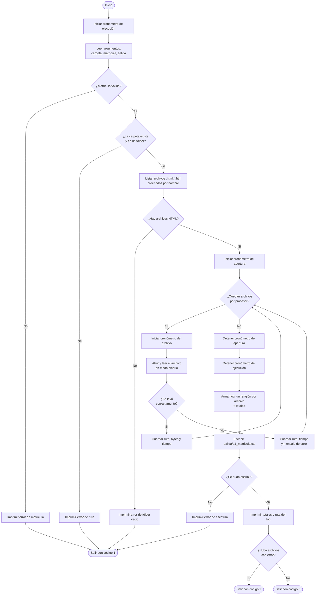

# Diagrama de flujo — Actividad 1

## Correspondencia con el código

| Paso del diagrama | Implementación |
|---|---|
| Leer argumentos | `main.construir_parser` |
| Validar matrícula y carpeta | `main.main`, `lector.listar_archivos_html` |
| Listar archivos HTML | `lector.listar_archivos_html` |
| Ciclo de apertura y cronómetro por archivo | `lector.abrir_archivo` |
| Cronómetro total de apertura | `lector.abrir_todos` |
| Cronómetro total de ejecución | `main.main` |
| Armar y escribir el log | `main.construir_log`, `main.escribir_log` |
